# 🏗️ System Architecture & Application Flows

Complete architecture diagrams, user flows, and technical implementation details for Personal Finance Coach.

---

## Tech Stack Overview

### Frontend
- **Web App**: Streamlit (Python)
- **State Management**: `st.session_state`
- **UI Components**: Native Streamlit widgets

### Backend & API
- **Framework**: FastAPI (Python)
- **Database**: PostgreSQL
- **ORM**: SQLAlchemy or Drizzle ORM (if using Node.js layer)

### AI & ML Stack
- **Frameworks**: LangChain, LlamaIndex, LangGraph (Agentic workflows)
- **Embeddings**: Hugging Face Transformers (sentence-transformers)
- **Vector Store**: ChromaDB / Weaviate
- **LLMs**: OpenRouter API (Mistral, Llama models)
- **RAG**: LangChain + LlamaIndex for document indexing & retrieval

### Infrastructure
- **Hosting**: Streamlit Cloud (Frontend) or Railway (Full Stack)
- **Storage**: S3 compatible (optional for uploads)
- **Caching**: Redis (for embeddings/API caching)

---

## 1. System Architecture Overview


---

## 2. Complete User Journey Flow

```mermaid
flowchart TD
    START([User Opens App]) --> AUTH{Authenticated?}
    
    AUTH -->|No| SIGNUP[Sign Up / Login]
    AUTH -->|Yes| CHECK_PROFILE{Profile<br/>Complete?}
    
    SIGNUP --> CREATE_ACCOUNT[Create Account]
    CREATE_ACCOUNT --> CHECK_PROFILE
    
    CHECK_PROFILE -->|No| ONBOARDING[Start Onboarding]
    CHECK_PROFILE -->|Yes| DASHBOARD[Dashboard]
    
    ONBOARDING --> STEP1[Step 1: Basic Profile<br/>Age, Country, Risk, Dependents]
    STEP1 --> STEP2[Step 2: Financial Snapshot<br/>Income, Expenses, Savings]
    STEP2 --> STEP3[Step 3: Assets<br/>Cash, FD, MF, Stocks, etc.]
    STEP3 --> STEP4[Step 4: Liabilities<br/>Loans, Credit Cards]
    STEP4 --> STEP5[Step 5: Goals<br/>Emergency, House, Retirement]
    
    STEP5 --> SYSTEM_ANALYSIS[System Analyzes Data]
    
    SYSTEM_ANALYSIS --> CALC[Calculate Metrics<br/>Net Worth, Savings Rate,<br/>Debt Ratios, Emergency Months]
    
    CALC --> BUCKETIZE[Auto-Bucketize Money<br/>Emergency, Debt,<br/>Short-term, Long-term]
    
    BUCKETIZE --> GENERATE_PLAN[Generate Plan<br/>Top 3 Actions +<br/>Monthly Targets]
    
    GENERATE_PLAN --> SHOW_PLAN[Show Plan to User]
    
    SHOW_PLAN --> USER_REVIEW{User Reviews}
    
    USER_REVIEW -->|Has Questions| WHY_THIS[Click "Why This?"<br/>RAG Explanation]
    WHY_THIS --> USER_REVIEW
    
    USER_REVIEW -->|Accepts Plan| DASHBOARD
    
    DASHBOARD --> USER_ACTION{What Next?}
    
    USER_ACTION -->|View Progress| PROGRESS_CHART[Progress Charts<br/>Net Worth, Debt Trend]
    USER_ACTION -->|Monthly Update| MONTHLY_CHECKIN[Monthly Check-in Form]
    USER_ACTION -->|Edit Data| EDIT_PROFILE[Edit Profile/Assets/Goals]
    USER_ACTION -->|Ask Question| ASK_AI[Ask AI Assistant]
    USER_ACTION -->|View Goals| GOAL_DETAIL[Goal Details & Progress]
    
    MONTHLY_CHECKIN --> INPUT_PROGRESS[Enter:<br/>Saved Amount<br/>Invested Amount<br/>Debt Paid<br/>Notes]
    
    INPUT_PROGRESS --> TRACK_PROGRESS[System Compares<br/>Actual vs Target]
    
    TRACK_PROGRESS --> STATUS{Status?}
    
    STATUS -->|On Track| ENCOURAGE[Show Encouragement<br/>"Great job! Keep going"]
    STATUS -->|Ahead| CELEBRATE[Celebrate Success<br/>"You're ahead! 🎉"]
    STATUS -->|Behind| CORRECT[Correction Nudge<br/>"Here's how to catch up"]
    
    ENCOURAGE --> DASHBOARD
    CELEBRATE --> DASHBOARD
    CORRECT --> DASHBOARD
    
    PROGRESS_CHART --> DASHBOARD
    EDIT_PROFILE --> SYSTEM_ANALYSIS
    ASK_AI --> WHY_THIS
    GOAL_DETAIL --> DASHBOARD
    
    DASHBOARD --> MILESTONE{Goal<br/>Achieved?}
    MILESTONE -->|No| USER_ACTION
    MILESTONE -->|Yes| SUCCESS([Success!<br/>Financial Freedom 🎯])
    
    style START fill:#87CEEB
    style SUCCESS fill:#90EE90
    style SYSTEM_ANALYSIS fill:#FFD700
    style BUCKETIZE fill:#FFD700
    style GENERATE_PLAN fill:#FFD700
    style WHY_THIS fill:#FFA500
```

---

## 3. Data Processing Flow


---

## 4. Agentic RAG System ("Why This?")

```mermaid
flowchart TB
    USER[User asks:<br/>"Why pay debt first?"] --> LANGRAPH_AGENT[LangGraph Agent Node]
    
    LANGRAPH_AGENT --> ROUTING{Agent Decision}
    
    ROUTING -->|Need Context| RETRIEVAL[RAG Retrieval Tool]
    ROUTING -->|Can Answer| GENERATION
    
    RETRIEVAL --> EMBED[HuggingFace Embeddings<br/>sentence-transformers]
    
    EMBED --> VECTOR_SEARCH[Semantic Search<br/>ChromaDB]
    
    VECTOR_SEARCH --> DOCS[(Knowledge Base<br/>Debt Strategy<br/>Investment Rules<br/>Tax Planning)]
    
    DOCS --> RERANK[Rerank Results<br/>by Relevance]
    
    RERANK --> CONTEXT[Build Context Window]
    
    CONTEXT --> GENERATION[LLM Generation Node<br/>OpenRouter API]
    
    GENERATION --> VALIDATE[Validation Node<br/>Check Citations]
    
    VALIDATE --> RESPONSE{Quality OK?}
    
    RESPONSE -->|No| LANGRAPH_AGENT
    RESPONSE -->|Yes| OUTPUT[Format Response<br/>+ Sources + Confidence]
    
    OUTPUT --> DISPLAY[Display to User]
    
    style LANGRAPH_AGENT fill:#FFD700
    style RETRIEVAL fill:#90EE90
    style EMBED fill:#87CEEB
    style GENERATION fill:#FFA500
```

---

## 5. Rule Engine Decision Tree


---

## 6. Monthly Progress Tracking Loop

```mermaid
stateDiagram-v2
    [*] --> PlanCreated: User completes onboarding
    
    PlanCreated --> SetTargets: System sets monthly targets
    
    SetTargets --> UserExecutes: User follows plan
    
    UserExecutes --> MonthEnd: End of month arrives
    
    MonthEnd --> SelfReport: User submits progress
    
    SelfReport --> EvaluateProgress: System evaluates
    
    EvaluateProgress --> OnTrack: Met all targets
    EvaluateProgress --> Ahead: Exceeded targets
    EvaluateProgress --> Behind: Missed targets
    
    OnTrack --> SendEncouragement: "Great job! 💪"
    Ahead --> SendCelebration: "Amazing! 🎉"
    Behind --> SendCorrection: "Let's adjust 🔧"
    
    SendEncouragement --> UpdateProjections
    SendCelebration --> UpdateProjections
    SendCorrection --> UpdateProjections
    
    UpdateProjections --> SetTargets: Next month
    
    SetTargets --> CheckGoals: Quarterly review
    
    CheckGoals --> GoalAchieved: Target met
    CheckGoals --> ContinueTracking: Keep going
    
    ContinueTracking --> SetTargets
    GoalAchieved --> [*]: Success! 🎯
```



---

## 7. Plan Generation Sequence


---

## 8. LangChain RAG Implementation Architecture


---

## API Architecture

### Key Endpoints

```
POST   /api/auth/register       - Create new user
POST   /api/auth/login          - Login user
GET    /api/profile             - Get user profile
PUT    /api/profile             - Update profile

POST   /api/snapshot            - Create financial snapshot
GET    /api/snapshot/latest     - Get latest snapshot

POST   /api/assets              - Add asset
GET    /api/assets              - List assets
PUT    /api/assets/:id          - Update asset
DELETE /api/assets/:id          - Delete asset

POST   /api/liabilities         - Add liability
GET    /api/liabilities         - List liabilities
PUT    /api/liabilities/:id     - Update liability

POST   /api/goals               - Add goal
GET    /api/goals               - List goals

POST   /api/plan/generate       - Generate financial plan
GET    /api/plan/current        - Get current plan

POST   /api/progress            - Submit monthly progress
GET    /api/progress            - Get progress history

POST   /api/rag/ask             - Ask RAG system
```

---

## Deployment Architecture


---

## AI/ML Pipeline Details

### Embedding Generation
```python
from sentence_transformers import SentenceTransformer

model = SentenceTransformer('all-MiniLM-L6-v2')
embeddings = model.encode(documents)
```

### LangChain Integration
```python
from langchain.chains import RetrievalQA
from langchain.vectorstores import Chroma
from langchain.llms import OpenRouter

vectorstore = Chroma(embedding_function=embeddings)
qa_chain = RetrievalQA.from_chain_type(
    llm=OpenRouter(api_key=OPENROUTER_KEY),
    retriever=vectorstore.as_retriever()
)
```

### LangGraph Agent
```python
from langgraph.graph import StateGraph

workflow = StateGraph()
workflow.add_node("retrieve", retrieval_node)
workflow.add_node("generate", generation_node)
workflow.add_node("validate", validation_node)
workflow.set_entry_point("retrieve")
workflow.add_edge("retrieve", "generate")
workflow.add_edge("generate", "validate")

agent = workflow.compile()
```

---

**Last Updated:** 2025-12-13  
**Version:** 3.2 (Complete AI Engineering Stack)  
**Tech Stack:** Streamlit + FastAPI + LangChain + LlamaIndex + LangGraph + Hugging Face + OpenRouter
